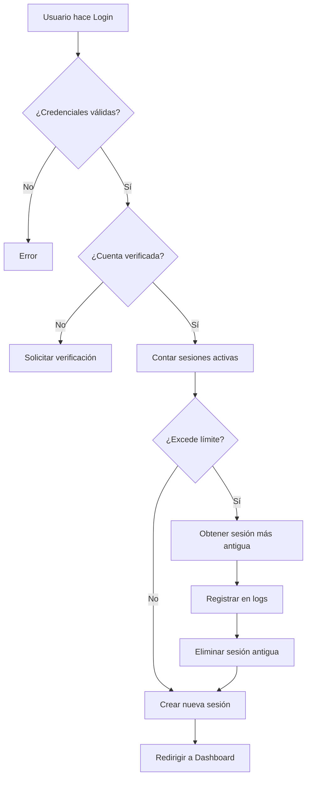

# 🎓 Plataforma Educativa con Gestión de Sesiones Concurrentes

## 📋 Descripción del Proyecto

Plataforma educativa desarrollada en **PHP 8.0+** con sistema avanzado de **gestión de sesiones concurrentes**, implementando **rotación automática** de dispositivos según el plan de suscripción del usuario.

### ✨ Características Principales

- ✅ **Autenticación Segura** con verificación por email
- 🔄 **Rotación Automática de Sesiones** según límites del plan
- 📊 **Dashboard Responsive** con Bootstrap 5
- 🔒 **Middleware de Seguridad** que expulsa sesiones rotadas
- 📧 **Notificaciones por Email** (PHPMailer + SMTP)
- 📝 **Auditoría Completa** de actividad de sesiones
- 💳 **Sistema de Planes**: Basic (1 sesión), Pro (3 sesiones), Premium (5 sesiones)

---

## 🚀 Instalación

### Requisitos Previos

- PHP 8.0 o superior
- MySQL 5.7+ o MariaDB 10.3+
- Composer
- Servidor web (Apache/Nginx)

### Paso 1: Clonar o Descargar el Proyecto

```bash
cd C:\xampp\htdocs\plataformaeducativa
```

### Paso 2: Instalar Dependencias

```bash
composer install
```

Esto instalará **PHPMailer** y todas las dependencias necesarias.

### Paso 3: Configurar Base de Datos

1. Crear la base de datos ejecutando el script SQL:

```bash
# Acceder a MySQL
mysql -u root -p

# Ejecutar el script
source database/schema.sql
```

O desde phpMyAdmin:
- Importar el archivo `database/schema.sql`

### Paso 4: Configurar Credenciales

Editar `config/config.php`:

```php
// Configuración de Base de Datos
define('DB_HOST', 'localhost');
define('DB_NAME', 'plataforma_educativa');
define('DB_USER', 'tu_usuario');
define('DB_PASS', 'tu_contraseña');

// Configuración de Email (SMTP)
define('SMTP_USERNAME', 'tu-email@gmail.com');
define('SMTP_PASSWORD', 'tu-app-password'); // Ver instrucciones abajo

// URL de la aplicación
define('APP_URL', 'http://tu-dominio.com');
```

#### 📧 Configurar App Password de Gmail

1. Ir a [https://myaccount.google.com/security](https://myaccount.google.com/security)
2. Activar **Verificación en 2 pasos**
3. Ir a **Contraseñas de aplicaciones**
4. Generar contraseña para "Correo"
5. Copiar la contraseña generada en `SMTP_PASSWORD`

### Paso 5: Configurar Permisos

```bash
# Linux/Mac
chmod -R 755 plataformaeducativa/
chmod -R 777 plataformaeducativa/logs/

# Windows (XAMPP)
# Asegurarse que el directorio logs/ exista
```

### Paso 6: Acceder a la Aplicación

```
http://localhost/plataformaeducativa/login.php
```

---

## 👥 Usuarios de Prueba

### Usuario Admin
- **Email**: `admin@plataforma.com`
- **Password**: `Admin@123`
- **Plan**: Premium (5 sesiones)

### Usuario Estudiante
- **Email**: `student@test.com`
- **Password**: `Student@123`
- **Plan**: Basic (1 sesión)

---

## 📁 Estructura del Proyecto

```
plataformaeducativa/
│
├── config/
│   ├── config.php          # Configuración general
│   └── db.php              # Conexión a base de datos (PDO)
│
├── classes/
│   └── EmailService.php    # Servicio de envío de emails
│
├── includes/
│   └── auth_check.php      # Middleware de autenticación (CRÍTICO)
│
├── database/
│   └── schema.sql          # Script SQL completo
│
├── logs/                   # Logs de errores (auto-generado)
│
├── vendor/                 # Dependencias de Composer
│
├── register.php            # Registro de usuarios
├── verify.php              # Verificación de email
├── login.php               # Login con rotación de sesiones
├── dashboard.php           # Panel principal
├── logout.php              # Cierre de sesión
├── composer.json           # Dependencias
└── README.md              # Esta documentación
```

---

## 🔐 Flujo de Autenticación y Seguridad

### 1. Registro de Usuario

```
Usuario → Registro → Validación → Hash Password (Argon2ID)
       → Generar Token → Guardar en BD → Enviar Email
```

### 2. Verificación de Email

```
Usuario → Click en Link → Validar Token → Activar Cuenta
```

### 3. Login con Rotación de Sesiones



### 4. Middleware de Autenticación (auth_check.php)

Este archivo se incluye al inicio de TODAS las páginas protegidas:

```php
require_once __DIR__ . '/includes/auth_check.php';
```

**Funciones:**

1. ✅ Verificar que exista sesión PHP
2. 🔍 Validar que el token exista en la BD
3. ⚠️ Si el token fue eliminado → EXPULSAR usuario
4. 🕐 Actualizar `last_activity`
5. 🔄 Regenerar ID de sesión cada 30 minutos

---

## 🎯 Lógica Crítica: Rotación de Sesiones

### Escenario de Ejemplo

**Usuario con Plan Pro (3 sesiones):**

1. **Login desde PC Casa** → Sesión 1 creada
2. **Login desde Móvil** → Sesión 2 creada
3. **Login desde Tablet** → Sesión 3 creada
4. **Login desde PC Trabajo** → ⚠️ Límite alcanzado:
   - Sistema busca sesión más antigua (`ORDER BY last_activity ASC LIMIT 1`)
   - Elimina Sesión 1 (PC Casa)
   - Registra evento en `session_logs`
   - Crea nueva Sesión 4 (PC Trabajo)

**Resultado:**
- El usuario en **PC Casa** ve el mensaje: *"Has excedido el límite. Cerrando sesión en este dispositivo"*
- Los otros 3 dispositivos continúan funcionando normalmente

### Código Clave (login.php:123-167)

```php
// Contar sesiones activas
$currentSessions = $db->fetchOne("SELECT COUNT(*) as total FROM active_sessions WHERE user_id = :user_id");

// Si excede el límite
if ($currentSessions['total'] >= $maxSessions) {
    // Obtener la sesión más antigua
    $oldestSession = $db->fetchOne("SELECT id FROM active_sessions WHERE user_id = :user_id ORDER BY last_activity ASC LIMIT 1");

    // Eliminarla
    $db->query("DELETE FROM active_sessions WHERE id = :id", ['id' => $oldestSession['id']]);

    // Registrar en logs
    $db->query("INSERT INTO session_logs (user_id, action, details) VALUES (:user_id, 'session_rotated', :details)");
}

// Crear nueva sesión
$db->query("INSERT INTO active_sessions (user_id, session_token, device_info) VALUES (...)");
```

---

## 🗄️ Esquema de Base de Datos

### Tablas Principales

#### `subscription_plans`
| Campo | Tipo | Descripción |
|-------|------|-------------|
| id | INT | ID del plan |
| plan_name | VARCHAR(50) | Basic/Pro/Premium |
| max_concurrent_sessions | INT | Límite de sesiones |
| price | DECIMAL | Precio del plan |

#### `users`
| Campo | Tipo | Descripción |
|-------|------|-------------|
| id | INT | ID del usuario |
| email | VARCHAR(255) | Email único |
| password_hash | VARCHAR(255) | Hash Argon2ID |
| role | ENUM | admin/student |
| subscription_plan_id | INT | FK a planes |
| is_verified | TINYINT | 0=No, 1=Sí |
| verification_token | VARCHAR(64) | Token único |

#### `active_sessions` (CRÍTICA)
| Campo | Tipo | Descripción |
|-------|------|-------------|
| id | INT | ID de sesión |
| user_id | INT | FK a users |
| session_token | VARCHAR(128) | Token único |
| device_info | VARCHAR(500) | User-Agent |
| ip_address | VARCHAR(45) | IP del cliente |
| last_activity | TIMESTAMP | Última actividad |

#### `session_logs` (Auditoría)
| Campo | Tipo | Descripción |
|-------|------|-------------|
| id | INT | ID del log |
| user_id | INT | FK a users |
| action | ENUM | login/logout/session_rotated/etc |
| device_info | VARCHAR(500) | Dispositivo |
| timestamp | TIMESTAMP | Fecha y hora |

---

## 🛡️ Seguridad Implementada

### ✅ Protecciones

1. **SQL Injection**: Prepared Statements con PDO
2. **XSS**: `htmlspecialchars()` en todas las salidas
3. **CSRF**: Token de sesión único
4. **Session Fixation**: `session_regenerate_id(true)`
5. **Password Hashing**: Argon2ID (más seguro que bcrypt)
6. **Rate Limiting**: Control de intentos de login
7. **Token Expiration**: Tokens de verificación expiran en 24h

### 🔒 Headers de Seguridad (Recomendado añadir)

```php
// Añadir en config.php
header('X-Frame-Options: DENY');
header('X-Content-Type-Options: nosniff');
header('X-XSS-Protection: 1; mode=block');
```

---

## 📊 Pruebas del Sistema

### Test 1: Verificar Rotación Automática

1. Crear usuario con Plan Basic (1 sesión)
2. Hacer login desde navegador Chrome
3. Hacer login desde navegador Firefox
4. **Resultado esperado**: Chrome debe ser expulsado

### Test 2: Verificar Middleware

1. Copiar `session_token` de la tabla `active_sessions`
2. Eliminar manualmente ese token de la BD
3. Refrescar página del dashboard
4. **Resultado esperado**: Redirección a login con mensaje de error

### Test 3: Verificar Expiración

1. Modificar `SESSION_LIFETIME` en `config.php` a 60 segundos
2. Hacer login
3. Esperar 61 segundos
4. Refrescar página
5. **Resultado esperado**: Sesión expirada

---

## 🌐 Despliegue en 000webhost

### Paso 1: Preparar Archivos

```bash
# Comprimir proyecto (sin vendor/)
zip -r plataforma.zip . -x "vendor/*" "logs/*" ".git/*"
```

### Paso 2: Subir y Configurar

1. Acceder a File Manager de 000webhost
2. Subir `plataforma.zip` a `/public_html/`
3. Extraer archivos
4. Ejecutar desde terminal SSH:

```bash
cd public_html
composer install --no-dev --optimize-autoloader
```

### Paso 3: Configurar Base de Datos

1. Crear base de datos desde panel de 000webhost
2. Importar `database/schema.sql` desde phpMyAdmin
3. Actualizar credenciales en `config/config.php`:

```php
define('DB_HOST', 'localhost');
define('DB_NAME', 'id12345_plataforma');
define('DB_USER', 'id12345_user');
define('DB_PASS', 'password_generado');
define('APP_URL', 'https://tu-sitio.000webhostapp.com');
define('APP_ENV', 'production');
```

### Paso 4: Configurar .htaccess (Opcional)

```apache
# Redirigir a login.php por defecto
DirectoryIndex login.php

# Forzar HTTPS
RewriteEngine On
RewriteCond %{HTTPS} off
RewriteRule ^(.*)$ https://%{HTTP_HOST}%{REQUEST_URI} [L,R=301]

# Proteger archivos de configuración
<FilesMatch "^(config|composer|README)">
    Order allow,deny
    Deny from all
</FilesMatch>
```

---

## 🐛 Troubleshooting

### Problema: "Error de conexión a la base de datos"

**Solución:**
- Verificar credenciales en `config/config.php`
- Comprobar que la BD existe
- Verificar permisos del usuario MySQL

### Problema: "No se envían emails"

**Solución:**
- Verificar credenciales SMTP en `config.php`
- Usar **App Password** de Gmail (no contraseña normal)
- Revisar logs en `logs/email_errors.log`
- Probar con otro servicio SMTP (ej: Mailtrap para desarrollo)

### Problema: "Session expired" al refrescar página

**Solución:**
- Verificar que `session_start()` se ejecute antes de cualquier salida
- Comprobar permisos de carpeta de sesiones
- Revisar configuración de cookies en navegador

### Problema: "Token de verificación expirado"

**Solución:**
- Extender tiempo de expiración en registro:
```php
$tokenExpires = date('Y-m-d H:i:s', strtotime('+48 hours')); // 48h en vez de 24h
```

---

## 📈 Mejoras Futuras (Opcionales)

- [ ] Panel de administración para gestionar usuarios
- [ ] Sistema de recuperación de contraseña
- [ ] Autenticación de dos factores (2FA)
- [ ] API REST para aplicaciones móviles
- [ ] Gráficas de actividad con Chart.js
- [ ] Sistema de notificaciones push
- [ ] Integración con OAuth (Google, Facebook)
- [ ] Modo oscuro en dashboard

---

## 📝 Notas para la Defensa del Proyecto

### Puntos Clave a Explicar

1. **Arquitectura de Seguridad**:
   - Uso de PDO con Prepared Statements (previene SQL Injection)
   - Password hashing con Argon2ID
   - Middleware de autenticación en cada página protegida

2. **Lógica de Rotación**:
   - Transacciones de BD para garantizar consistencia
   - Selección de sesión más antigua por `last_activity`
   - Registro de eventos para auditoría

3. **Diseño Responsive**:
   - Bootstrap 5 con grid system
   - Mobile-first approach
   - Accesibilidad (etiquetas semánticas, ARIA)

4. **Escalabilidad**:
   - Índices en tablas para optimización
   - Procedimientos almacenados para limpieza automática
   - Vista SQL para consultas complejas

---

## 👨‍💻 Autor

**Proyecto Académico** - Plataforma Educativa con Gestión de Sesiones Concurrentes

---

## 📄 Licencia

Este proyecto es para fines educativos.

---

## 🆘 Soporte

Para problemas o preguntas:
1. Revisar logs en `/logs/`
2. Verificar configuración en `config/config.php`
3. Consultar documentación de PHPMailer: https://github.com/PHPMailer/PHPMailer

---

**¡Sistema listo para producción! 🚀**
